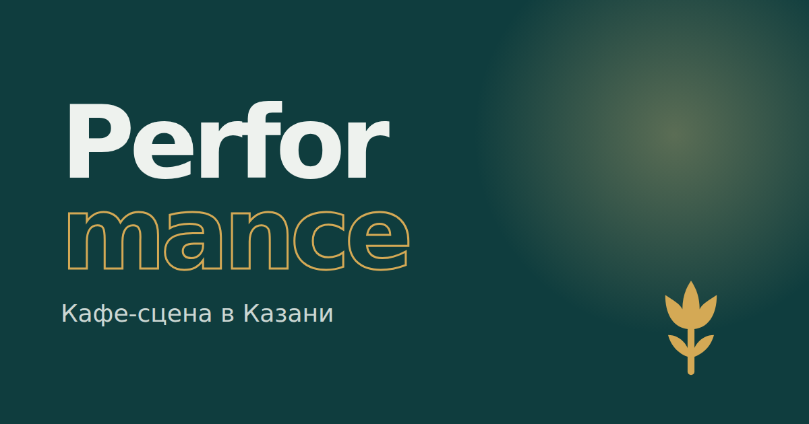

# Performance — кафе-сцена в Казани

Учебный проект для портфолио: сайт вымышленного кафе в Казани. Три страницы (главная, «О нас», админка), два языка (русский и татарский), светлая и тёмная тема, установка на телефон как приложение.

**Открыть сайт:** https://bogomol499.github.io/performance-kazan/
**Админка:** https://bogomol499.github.io/performance-kazan/admin.html (пароль `performance`)



## Что умеет сайт

**Главная**
- Экран загрузки: чашка наполняется кофе, проценты считаются, потом экран уезжает вверх.
- 3D-тарелка с эчпочмаком на первом экране: поворачивается за мышкой или при наклоне телефона.
- Меню из 19 блюд: категории, поиск (по-русски и по-татарски), фильтры «Без мяса», «Острое», «Хиты», «До 300 ₽».
- «Что взять?» — три вопроса, и сайт подбирает блюда и напиток.
- Конструктор завтрака: основа, до 4 добавок и напиток. Добавки падают на тарелку, цена считается с анимацией.
- Корзина и заказ с собой: имя, телефон с маской, время. Заказ сразу виден в админке.
- Программа недели: карточки едут вбок при прокрутке. Кнопка на карточке подставляет день и время в бронь.
- Подарочный сертификат: сумма, дизайн, подпись. Открытка переворачивается в 3D и скачивается картинкой PNG.
- Бронь со схемой зала: занятые столы серые, маленькие столы недоступны для большой компании, выбранный подсвечивается.

**О нас**
- История: линия заполняется при прокрутке, годы подсвечиваются.
- Команда: карточки переворачиваются и показывают рассказ о человеке. Портреты нарисованы кодом.
- Галерея: ленту можно тянуть мышкой или пальцем, картинки открываются крупно и листаются.

**Админка** (демо, данные из того же браузера)
- Вход по паролю.
- Обзор: заказы и выручка за сегодня, средний чек, гости, популярные блюда, ближайшие брони.
- Заказы: статусы «Новый → Готовится → Готов → Выдан», отмена.
- Брони: подтверждение и отмена, фильтры по дням.
- Меню: смена цены, «Хит», стоп-лист. Изменения сразу видны на сайте, даже в открытой вкладке.
- Кнопка «Заполнить примерами», чтобы показать админку не пустой.

**Везде**
- Анимации привязаны к прокрутке: элементы прилетают и улетают в обе стороны.
- Тёмная тема включается круговой «заливкой» из точки нажатия.
- Русский и татарский языки, переключатель «Рус / Тат».
- Работает без интернета после первого открытия, ставится на телефон как приложение.
- Адаптивная вёрстка, управление с клавиатуры, учёт настройки «уменьшить движение».

## Технологии

HTML, CSS и JavaScript без библиотек и фреймворков. Service Worker, Web App Manifest, View Transitions API, Canvas (открытка PNG), Web Animations API, localStorage и событие `storage` для связи вкладок.

## Структура

```
index.html            главная
about.html            «О нас»
admin.html            админка
css/style.css         основные стили и цвета тем
css/features.css      загрузка, 3D-тарелка, конструктор, квиз, сертификат, схема зала
css/pages.css         «О нас» и админка
css/motion.css        анимации при прокрутке
js/data.js            меню, программа, вопросы, столы, команда — всё содержимое
js/i18n.js            татарский перевод интерфейса
js/art.js             рисунки блюд, портреты, галерея (SVG)
js/core.js            общее: язык, тема, корзина, заказы, брони, панели
js/app.js             главная страница
js/about.js           страница «О нас»
js/admin.js           админка
js/motion.js          анимации прокрутки, плавная прокрутка
sw.js                 работа без интернета
```

## Как поменять содержимое

Блюда, цены, программа вечеров, вопросы, столы и команда лежат в `js/data.js`. У каждого текста два варианта: `ru` и `tt`.

---

Кафе вымышленное, заказы и брони никуда не отправляются.
